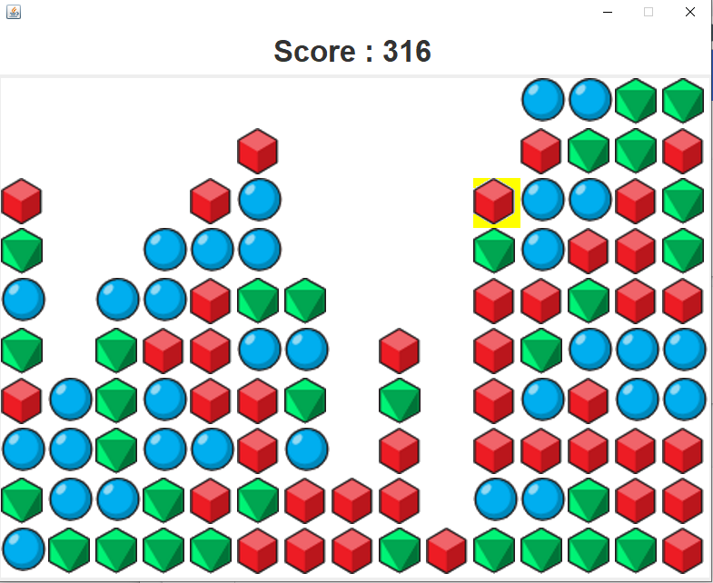

# SameGame

## Présentation

Le projet est un jeu de SameGame dont le but est de faire disparaitre tous les blocs du terrain de jeu. Celui-ci est sous la forme d’un rectangle. Les blocs sont divisés en trois couleurs différentes

### Le menu

### Le jeu

### Fin du jeu

### Top 10
A la fin d'une partie le score est enregistré dans une base de données mysql et les 10 meilleurs score sont affichés.

